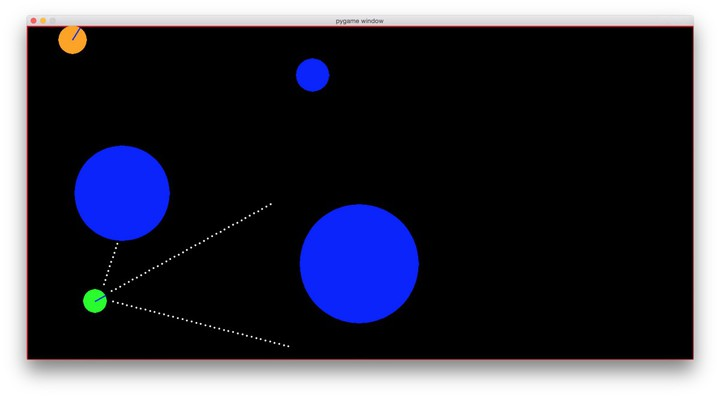
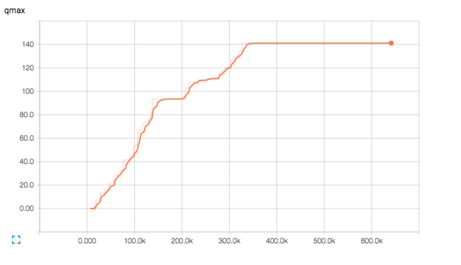
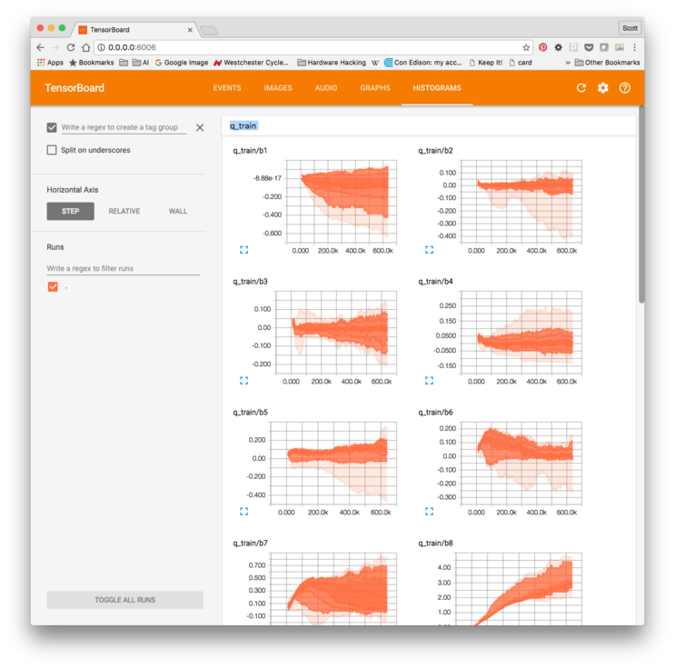
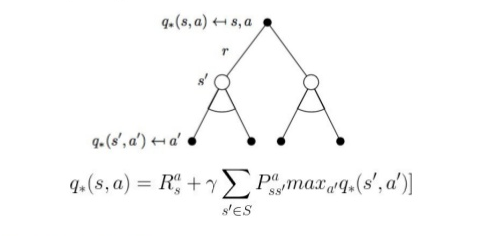
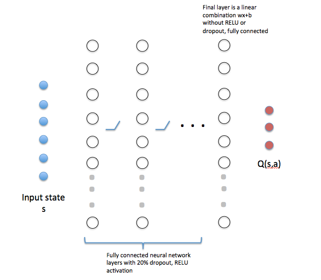
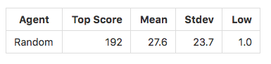
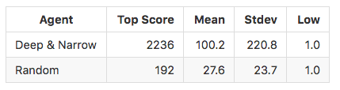
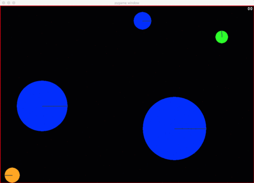
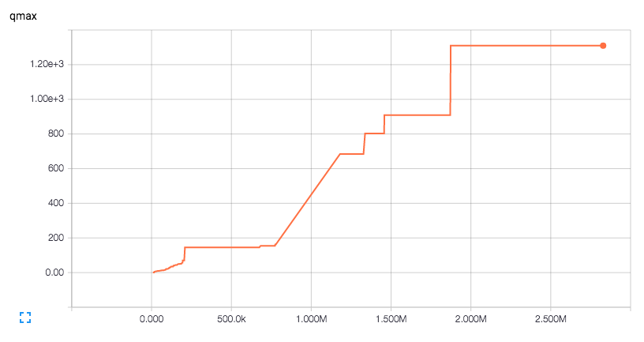
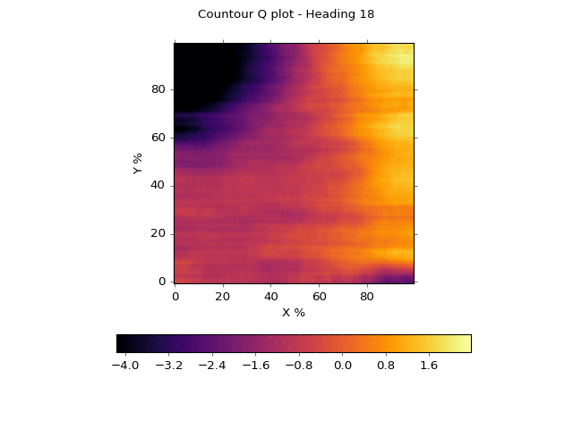

# PacFlow
## Pedagogical Autonomous Cars with TensorFlow

This project was submitted in partial fulfillment
of the Udacity Machine Learning Engineer Nanodegree.

Scott Penberthy  
November 1, 2016

## I. Definition

### Project Overview
Self-driving cars are fascinating.  However, the learning curve is steep.  We noticed a lack of simple environments
for experimenting with the underlying algorithms in pedagogical settings.  We have built one such environment here, which a programmer can run just fine _without_ expensive GPUs.  

Our virtual environment is a derivative of 
[Matt Harvey's virtual car](https://medium.com/@harvitronix/using-reinforcement-learning-in-python-to-teach-a-virtual-car-to-avoid-obstacles-6e782cc7d4c6#.58wi2s7ct), 
ported to work with TensorFlow, Python 2.7, and PyGame 5.0. The
machine learning algorithm is based on 
[Deep Q Reinforcement Learning](http://home.uchicago.edu/~arij/journalclub/papers/2015_Mnih_et_al.pdf), 
without the "deep" part.  Many of the ideas
were derived from [songotrek's Tensorflow implementation](https://github.com/songrotek/DQN-Atari-Tensorflow/blob/master/BrainDQN_Nature.py) of DeepMind's
[Atari-playing Deep Q Learner](http://home.uchicago.edu/~arij/journalclub/papers/2015_Mnih_et_al.pdf)


### Problem Statement


Your job is to write an AI for a simulated toy car that learns to drive by itself.  

The figure above captures our toy car scenario.  The car is shown in green, sensing the environment
via three sonar sensors. Three slow-moving obstacles are shown in blue.  A cat darts around the
environment in orange.   Our challenge is to build a learning algorithm that learns to drive
without hitting things.  The car's throttle is stuck in the "on" position.  Hey, its a cheap toy.

### Prerequisites
1. [Anaconda Python Distribution, 2.7](https://www.continuum.io/why-anaconda) for Python
2. [Tensorflow for Anaconda](https://www.tensorflow.org/versions/r0.11/get_started/os_setup.html#anaconda-installation) for AI
3. [PyGame](http://www.pygame.org/wiki/GettingStarted) for graphics
4. [PyMunk](http://www.pymunk.org/en/latest/) for physics
5. [Numpy](http://www.numpy.org/) for math
6. [SciPy](http://www.scipy.org/) for more math to smooth plots

This has been successfully tested on a MacBook Pro running OS X El Capitan.

### Running the code
After successfully cloning this repository and installing all the prerequisites, ```cd``` to
the repository directory so we have access to ```learning.py``` and ```carmunk.py```.  Let's activate
the TensorFlow environment and launch an interactive python shell:

```
% source activate tensorflow
(tensorflow) % ipython
Python 2.7.12 |Continuum Analytics, Inc.| (default, Jul  2 2016, 17:43:17) 
Type "copyright", "credits" or "license" for more information.

IPython 5.1.0 -- An enhanced Interactive Python.
?         -> Introduction and overview of IPython's features.
%quickref -> Quick reference.
help      -> Python's own help system.
object?   -> Details about 'object', use 'object??' for extra details.

In [1]: 
```

Next, let's import our file then create our Deep Q learner environment in 
one line of code!
```python
In [1]: from learning import *

In [2]: ai = Learner()
```

_[ed. At the time of this writing, you may see warning statements on a Mac about using outdated audio controls.  That's OK.  We don't
need audio for this task.]_

The ```ai``` object is our Deep Q Learner, without the deep, controlling a simluated game ```g```
analyzed by a Tensorflow session ```s```.  Let's get into it.  Try the following to demo 1000 steps of
the simulator and watch the car drive!  At this point the algorithm is purely random.

```python
In [3]: ai.demo()
```
You can try each step yourself, going straight, left or right.  You'll see three items returned,
the reward, an array of sensor readings, and a boolean indicating whether you've hit a wall
or object:

```python
In [4]: ai.g.step(0)
(-2.0, array([ 6.        ,  4.        ,  6.        ,  0.13147931,  0.16259441,
         4.68615124]), False)

In [5]: ai.g.step(1)
(-2.0, array([ 4.        ,  4.        ,  6.        ,  0.12923619,  0.14867274,
         4.48615124]), False)


In [6]: ai.g.step(2)
(-3.0, array([ 5.        ,  3.        ,  5.        ,  0.12897384,  0.13439194,
         4.68615124]), False)
```


### Performance Metrics

We will evaluate our algorithm by comparing its top score performance in
1000 games against an agent that picks actions randomly.  That's all that 
matters in the end -- bragging rights for the most number of iterations
before a crash.  We need to do (much) better than random chance.

### Training Metrics



As we seek to beat random chance and improve our performance, we'll also
want to track how well our algorithm is progressing.  We will be tracking
QMax as described in the Deep Q Learning paper.

Technically, Qmax is the maximum Q value seen by the neural network that's learning
to estimate the Q function,
across all training examples, across time. As the agent learns its better able to predict what action to take, leading to
higher rewards over time.  The longer the agent stays alive, the greater the reward, the higher the Q value.

### Visualizing Progress

We'll use the TensorBoard visualizer available with Tensorflow to see our top score and QMax change over time.
Our learning agent sits and observes for several thousand iterations before learning.  Like Mom taught us, 
it pays to listen and observe before making judgment!

Tensorboard runs as a local Java application, serving web pages as its GUI on a local port.  This is Google, after all.
The visualizer reads log data from the "train" subdirectory and periodically updates the display as log data
grows.  I find that periodically cleaning this directory is quite useful.

To see this work, let's mute the graphic display and run 25,000 iterations:
```python
In [7]: ai.mute()
True

In [8]: for i in range(25000): ai.step()
```
Now launch another terminal and ```cd``` to the repository directory, activating tensorflow
as before.  You'll see new content in the
log directory.  Your log filename will be different than mine, a combo of time and your local machine
name.  Launch tensorboard and point to this directory.
```
% source activate tensorflow

(tensorflow) % ls train
events.out.tfevents.1476194157.Scotts-MBP.home 

(tensorflow) % tensorboard --logdir train
Starting TensorBoard 23 on port 6006
(You can navigate to http://0.0.0.0:6006)
```
Launch your browser and navigate to http://0.0.00:6006.  You'll see three numbers we're tracking, loss, qmax and
score. Loss represents the amount of error in a random sample of historical frames, taken every learning
cycle.  QMax and Score are tracked over time, too.  Click to reveal or hide plots.

If you're curious, click on the "histograms" tab to see our network weights and biases change over time
as shown below. "q_train" refers to the training network that feeds on the memory of the last
32,000 events.  A "bn" metric represents the bias values with "wN" weights value in neural network
that computes yN = wN*x + bN.  

Here's how to read the chart.  

Each vertical slice in time is a modified statistical box plot, which
shows the first and second standard deviations as a band of dark (1) and lighter (2) orange,
with a faded orange for outliers.  When we plot these bands closely together
and connect the regions, we get a flowing orange shape showing our distribution "on the side" as the
statistical mean shifts over time. 



## II. Analysis

### Data Exploration
The simulator provides the following information about the car at every cycle:
- s1, s2, s3 - 3 sensor readings from 0-40
- x - x position, [0,1] where 0 is far left, 1 far right
- y - y position, [0,1] where 0 is top, 1 bottom
- theta - the heading angle of the car, 0 to 2*pi

You're allowed to take three actions:
- 0, stay on course
- 1, turn left by 0.2 radians
- 2, turn right by 0.2 radians

In addition to the sensor readings, the simulator also returns the following at
each iteration:
- Reward, an integer in [-100, 10] where negative values are bad, positive values are good
- Terminal, a boolean indicating whether a crash has occurred

Our challenge is to choose an action (0,1 or 2) at each time step.  We're only given the state (s1,s2,s3,x,y,theta), 
a prior reward, and a boolean.  

When we're driving free and clear, the reward varies over
the interval [-4, 34] which represents the shortest distance recorded by a sonar sensor
offset by -6.  Thus, if one
sensor has a reading of 2, the reward will be -4.  

A crash occurs when a sensor reading of 1 senses an object, returning a reward of -100.  The simulator randomly shifts
and rotates the car in an attempt to "get free" from the obstacle. Think of this as an amygdala-driven safety
reaction to danger, like a cat springing into the air at the sight of a cucumber.


The x and y position are floating point numbers varying from 0 to 1, indicating how far along each axis we sit.  The
angle is measured in radians, varying from 0 to 2*Pi.  These measurements are a replacement for "SLAM" technology
that simultaneously creates maps of the environment from richer sensor data.  The hope here is that the learning
algorithm figures out to stay closer to the middle, to turn away from walls, and to avoid objects when they're 
getting close.

### Exploratory Visualization


Here we see an animation of the environment where actions are chosen
at random.  The green car moves and not that well.  Each time it collides with
an object, wall, or cat, the screen blinks red.  The sensors are shown as
white dots eminating from the car.  These are the lines used to detect
the distance to objects.

We can see this in slow motion, too, controlling updates with our mouse
movement and 
terminating with control-C.  We flip the mute switch until it returns
False, meaning that the display will be active.  We call the ```explore```
method of our learning agent.  Each mouse or keyboard action
advances the play, printing out the current time step, the six
state values [s1, s2, s3, x, y, theta] and the reward R.  While
the visual animation is easier to understand, the numbers
give us a sense of the actual input to the learning algorithm.
```
In [8]: ai.mute()
Out[8]: True

In [9]: ai.mute()
Out[9]: False

In [10]: ai.explore()
11 [0.1, 0.675, 0.375, 0.19214722317827213, 0.2243449725383465, 0.14323944878270578] R= -3.0
12 [0.075, 0.825, 0.375, 0.19979564505111702, 0.2335480823560278, 0.11140846016432673] R= -2.0
13 [0.1, 0.9, 0.675, 0.20857147067002074, 0.24039701862180216, 0.07957747154594766] R= -3.0
14 [0.075, 0.8, 0.35, 0.21621989254286564, 0.24960012843948348, 0.11140846016432673] R= -2.0
15 [0.1, 0.875, 0.7, 0.2249957181617694, 0.2564490647052578, 0.07957747154594766] R= 10.0
16 [0.575, 0.4, 0.4, 0.23454908305302546, 0.260670781943277, 0.04774648292756859] R= 6.0
^C
KeyboardInterrupt:

In [11]: 
```

### Algorithms and Techniques


This toy car scenario can be formalized by the diagram above.  We have an agent, the car, at the top of the diagram.  At a point
in time t we must choose an action a_t.  This agent interacts with environment, causing the state of the
environment s_t+1 to change in the next time step t+1.  In addition the agent receives a perceived reward r_t.  The agent
then considers the tuple (s_t, a_t, s_t+1, r_t) and decides upon the next action a_t+1.  This repeats ad nauseum.

The machine learning literature calls this a _reinforcement learning_ problem.  Each action is "reinforced" through positive
or negative "reward", getting us closer or farther away from a desired "state."  Let's define a function Q(s_t,a_t) as
the expected, cumulative reward of taking action a_t in state s_t.  How might we calculate this magical function Q?

We can define this recursively as a dynamic programming problem.  Q(s_t,a_t) becomes the reward r_t we receive 
for taking action a_t, plus the _best_ cumulative reward available in the new state s_t+1.  The best reward is then
the maximum Q(s_t+1,a_t+1) available in s_t+1.  The best action to take in a state is always the action a_t that
has the highest Q value.  This leads to the insightful, recursive Bellman equation:



Bellman defines a learning parameter, gamma, that tells us how much of our previous estimate of q(s,a)
we want to believe when updating values (from 0-100% or 0.0-1.0).  We want to learn slowly and deliberately, ironing out statistical
outliers.  Gamma is often quite close to 1.0, or 0.9 in our case.

This seems easy enough, but how do we pick initial Q values?  What's interesting is that, over infinite time, it doesn't
really matter!  With infinite iterations of this algorithm the values of Q(s,t) will settle to an optimal plan.  Common
practice starts with something reasonable, namely some white Gaussian noise around 0.

Many implementations keep track of a "Q state table" which we update every cycle based on actions and observations.  This
is fine for simple puzzles and games, but it quickly falls apart for domains with very large state sets.  The toy car example
uses floating point numbers for the sensors, position and angle, and has an infinite state space.

We replace the state table with a neural network shown below.  We use the existing state s_t as the input values.  These are then
fed through multiple hidden layers with nonlinear activation and dropout, followed by a final linear combination
layer.  The output layer corresponds to a single neuron for each potential action, which
in this case yields 3 nodes. 



In our code, the number of nodes in each hidden layer are kept in an
array ```n_hidden```.  For example the code below specifies a network with a first layer of 64 neurons, 
followed by 3 layers of 128 nodes each, then a final linear layer of 64 nodes:

```python
In [10]:  n_hidden =[64] + [128]*3 + [64]
```

The neural network "learns" the Q state table by solving a non-linear regression, mapping an input state s
to the numerical values for Q(s,a_i) for all actions a_i.  For our scenario, we have 6 input variables and 3 output
variables.  Keeping in line with
earlier observations about Q(s,t), we initialize
the network with white noise.  The weights are Gaussian noise about 0, with a standard deviation of 0.01.  The biases
are all positive, again at 0.01, shifting the solution space slightly away from 0.

That's fine, but how what do we "train" this network?  Isn't that supervised learning, where we want the ultimate
solution?

This is the ingenius trick of the Deep Q Learning crowd.  They use _two_ copies of the neural network, one to train, and
another to calculate the Q(s_t+1, a_t+1) "target" values.  The "training" network feeds not on the current actions, but on
a sample of recent history called a "minibatch."  We calculate the maximum Q(s,t) values of the minibatch, then use
this as the target value when adjusting weights in the training network (via gradient descent, minimizing the squared error
between our predicted Q values and the target Q values).  We repeat until we've completely refreshed
the recent history.  At that point in time we copy all the weights from the training network to the active, target network
and repeat.

The target network drives actions in the simulator and updates the recent history.  We keep
the training network "offline" to prevent thrashing. If you look carefully at our QMax values from before, you'll notice a staircase effect as the values climb over time.  Each step up occurs when the smarter training network 
is copied to the target network.  Neat, huh?


### Benchmark

We want to ensure that our algorithm is doing better than random chance.  We seed all
the random generators to 0, then evaluate the agent by playing 1000 consecutive games.  The score of
a game is defined by 
the number of frames before a crash occurs, at which point a game ends.  The car recovers like a cat
jumping from a cucumber, then the next game begins.  We report basic statistics on the scores from
the 1000 games. The score to beat is 192.



## III. Methodology

### Data Preprocessing

We normalize input parameters so they all fall between 0 and 1.  This prevents 
bias towards parameters with larger absolute values.  

The x,y positions are left unchanged.  The angle theta is
modulated by 2 Pi, then scaled by 1/(2 Pi).  In earlier versions of the code we found that
the angle would increase into the thousands of radians, sending our network into a tailspin
as biases would shift.  The modolu fixed that.  Sensor readings are scaled by 1/40.

We explored scaling the rewards similarly, between -1.0 and 1.0.  This was done in the original deep Q learning
paper so that various Atari games were treated similarly.  Perhaps it was impatience, but we found
that the network failed to learn much in the first million iterations.  The higher
reward values made learning easier, as the reward "signal" stood out from the Gaussian noise embedded within
the network.  With smaller reward values, the Gaussian noise hid the signal and the network floundered.

### Implementation

Our implementation consists of essentially two files.  

```carmunk.py``` is a port of the original CarMunk car driving
game so that it works properly with PyMunk 5.0 and Python 2.7.  We made
one important change -- the reward for a crash is now -100 vs. -500 in the original
design.  More on that later. We observed broad oscillations in the weights and biases with the -500
value, causing very spikey loss results. 

```learning.py``` is an implementation of Deep Q reinforcement learning using Tensorflow
for building our neural network.  We say our implemenation is "without the deep," as our network
is a simple, fully-connected network versus their deep convolutional network with hundreds of layers.  We
are not operating from pixels, nor do we want to insist on an expensive GPU.
We focus on a simpler, pedagogical problem of three sensors
and toy game physics.

The environment begins by loading ```learning.py```, instantiating a Learner() object, then
invoking a few simple commands.  Let's work through it.  

As a good measure, ```cd``` to the directory
where you've loaded this repository, activate the virtual Tensorboard Python environment,
clean out the training log data, launch
tensorboard as a background process, and launch 
an interactive Python shell. I often run tensorboard in a separate terminal window
and let it sit.
```
% source activate tensorflow

(tensorflow) % rm train/*

(tensorflow) % tensorboard --logdir train &
[ some logging output will appear]

(tensorflow) % ipython
```

Let's load and instantiate a Learner class within our iPython shell:

```python
In(1): from learning import *

In(2): ai = Learner()
```

You should see a separate window with our game environment, paused at the
initial state.  Let's make sure everything is working.  Try 1000 steps:

```python
In(3): ai.demo()
Games played  36
Epoch Max score 95
Epoch Mean score 27.4444444444

In (4): 
```
The demo will print out basic statistics for your score and how
many games were played.  Score is the frame count before
a crash.

Now let's train for a bit.  We have a routine "cycle" that runs 100,000 but
steps 10,000 (an "epoch") at a time.  This will "mute" the graphics
display for speed.  After every 10,000 steps, we print out 
our current time, then an array showing the mean "loss" encountered
in our training batches, the minimum lass, the standard deviation,
and the maximum loss.  

```python
In(4): ai.cycle()
t= 11000
[654.53412, 322.84866, 86.578796, 1414.0239]
```

Let s be the states in a minibatch whose size is specified by
```n_batch_size``` taken from a state memory of size ```n_memory_size```.
Loss is the difference between
the sum of squares of Q(s,a) for all actions a as calculated 
by the training network, versus the desired output which is the
sum of squares of (reward_a + Max(Q(s',a))) as calculated
by the target network for action a.  Recall that this is Bellman's equation, and
we want to train our network to produce a nonlinear regression so that
Q(s,a) is accurate, for all actions, in one feed forward pass.

After we have seen ```n_observe``` steps, we also print descriptive statistics
for the performance of our network every time we copy the trained network
to our target network, as specified by ```n_network_update_frames```.  Recall
that the Deep Q Learning algorithm trains a separate network on minibatches
of experience history while it simultaneously runs the agent using a 
target network.  This prevents thrashing and overfitting.

```python
In(4): ai.cycle()
t= 11000
[654.53412, 322.84866, 86.578796, 1414.0239]
Games played  539
Epoch Max score 144
Epoch Mean score 30.3580705009
t= 21000
[474.16202, 251.2959, 79.489487, 1243.3118]
Games played  774
Epoch Max score 223
Epoch Mean score 42.6255319149
t= 31000
[388.32297, 202.05305, 79.290771, 1086.0581]
Games played  1020
Epoch Max score 153
Epoch Mean score 40.5081300813
t= 41000
[470.96552, 234.70471, 129.87579, 1320.3688]
Games played  1281
Epoch Max score 251
Epoch Mean score 38.3908045977
t= 51000
[549.32666, 203.20442, 176.22263, 1079.8307]
Games played  1546
Epoch Max score 226
Epoch Mean score 37.7773584906
t= 61000
[610.16583, 232.79211, 224.97626, 1264.9712]
Games played  1759
Epoch Max score 484
Epoch Mean score 46.5774647887
...

```

As you can see, the top score is slowly but gradually improving!  

#### A note on reward "normalization"

Here's the problem we discovered in the original ```carmunk``` game.  During backpropagation
that adjusts weights in the network, we look to minimize loss.  Our loss was the sum of squares
between predicted Q(s,a) and target Q(s,a) values.  The reward for most states
falls in the 0-40 range given the maximum distance a sonar travels without
hitting an object.  Further, this range had a mean of 20.  Our network begins with
output values that are close to zero with a bit of white Gaussian noise.  That means
our initial loss is typically 400-1200.  The network would adjust weights to
reduce this number closer to 0. 

Now assume we're near an optimal loss, then a crash happens, perhaps due to the cat
approaching us from behind.  The crash introduces a loss of 25,000, more than 100x
worse that what we typically see.  This spike sends a shockwave through the neural network,
causing weights to take a larger step down a gradient curve to account for the
error.  However, this large step can have a deleterious effect on other outputs,
skipping over local and global minima, pushing
us much further from optimum. The network slowly recovers and starts fine-tuning the network
to handle the most common case.  Then, a crash happens, and we kick the
network into another tail spin.

This would repeat ad-nauseum.  We'd see the network approach a minimal loss, experience
a spike, and the loss would swing wildly.  

Mathematically speaking, our original problem space has an unusually large
bias towards one parameter, creating a non-uniform shape that is difficult to traverse
with gradient descent.  The large bias creates significant, numerical cliffs in the
gradient space.  Its as though we were traversing a mountain, get near a peak, then
slipped off the edge and fell into an abyss, only to slowly climb up the hill again
and repeat the process.  Not fun.

Reducing the magnitude of the reward lowers the bias, softens the cliffs,
and makes our network less prone to these oscillations.  The lesson learned here is
that we need rewards to stand out from the white Gaussian noise, but irregular or dramatic
shifts can wreak havoc on gradient descent.  We call this _reward normalization_.

#### Tensorflow 101

Let's talk a bit about Tensorflow, the library we use for our neural network, which
will be new to many researchers.

Tensorflow has a Python front-end where you first define all the input
variables, the networks, and the output variables.  This forms a data pipeline, much like the graphics
pipelines common in videogames.  When you "run" a network forward, Tensorflow interacts with
a compiled implementation in C and C++ and returns the values to Python.  This scales to larger networks by running
that same code in a distributed manner, where the intense computations can be run in the cloud, or soon
in the cloud with hardware acceleration via TPUs and GPUs.  When we "run" the backpropagation, Tensorflow
performs the matrix determinants and multiplications with the C and C++ code, adjusting weights and returning values.

Tensorboard is a visualizer for variables, weights, biases and more.  You'll see a rather peculiar trick, where we stuff the values
for our maximum Q value and maximum Score from Python into Tensorflow on every iteration.  Tensorboard can only
report on values stored in the C/C++ pipeline.  We dump the results to the log file every 100 iterations
to keep the log file sizes in check. This took me a bit of time to figure out.

In a separate browser window, navigate to "http://0.0.0.0:6006" to see Tensorbard visualizations
of our network as it trains, which we showed earlier.  The repository begins with the good network 
which consists of 8 layers.  Tensorboard will show you the weights as wN and biases as bN for each
layer, as well as the loss, q_max, and top score over time.

#### Implementation challenges

A lot of these libraries were new for me.  The primary challenges were grok'ing how to work with Tensorflow
and Tensorboard, and the separation of variable space between Python and the C/C++ data pipeline.  Next, PyGame
and PyMunk had released a new version of the code that broke the original CarMunk, so we had to figure out both
the physics library and the gaming environment.  Finally, we had to implement the Deep Q Learning algorithm but
substitute our simpler, pedagogical network for their convolutional network.  

The longest standing bug was
an improper treatment of the target and training networks.  For a few weeks I was training and simulating the
same network, then copying it to an offline target.  Wrong.  My learner kept thrashing and not progressing well,
causing me to wonder if simple networks would even work!  By careful digging in the related research to Deep Q
Learning, I found a paper that explained how neural networks are unstable when you train and drive reinforcement
learning at the same time.  Well, how about that.  I carefully analyzed the code and found my mistake.  Once
that was in place, the learners took off!

Originally I had planned to introduce
a simple approach for working with GPUs, too.  After blowing a few hundred dollars on GPU hosting, though, I felt
that was unreasonable for an academic exercise, and switched gears to simpler networks.  I also wanted to share
my carefully honed Docker containers.  Wrestling NVida, Amazon, Docker, Tensorflow, PyGame, and MatPlotLib proved
frustrating.  Even after I got them running, the cost of the daily container would exceed $500/month for 1 GPU, and
one wasn't interesting.  I sense market opportunity... 

### Refinement

We started with the best network ideas available online, namely a two-layer network.  This worked quite well, but we
were annoyed that the car kept crashing.  We tried several tricks from the literature:

- Like Deep Q, we initially stacked the last four (4) state readings into a single input.  This got us to 120 for QMax.
- We increased the stacking to 16.  This got us to 140 Qmax, and seeemed to be the alltime winner.
- We tried a shallow network with limited nodes (two layers of 32 nodes) and a single input.  This got us nowhere, often worse
performance than random.  The interactions would seem random.  While we could see the entire picture of what was
going on, the poor agent only had three feelers.  Its like feelings around in the dark with 3 poles.  Our agent was
often surprised by the cat or a large object from behind, or backing into a wall.
- We ran a grid search on a two-layer network, from 32 nodes to 512 nodes each.  The larger networks
would take longer to train.  Yet, our top value for QMax wouldn't budge over 140, often ending up less.  We took the best
network and let it run for 2 million iterations.  No joy.
- We tried a smaller memory size and larger batch size.  The network would thrash, as documented
in literature.  We needed a much larger memory (32,000 events) with a smaller batch size of 32.
- We tried more sensors.  We added sensors to the back of the car.  We saw the agent learn faster, with
fewer iterations.  Still, the car was crashing and the 140 QMax was not exceeded.  We needed a better
internal representation of what was going on.  Two layers wasn't cutting it.

Finally, we wondered if going deep was the answer.  We created a narrow but 8-deep neural network, starting
with 32 nodes, then 6 layers of 64 nodes, then a final layer of 32 nodes.  This quickly got to our magical
140 and sat there for hundreds of thousands of iterations.  We let it run over the weekend.

The network trained slowly, as though
the intelligence was seeping in from the right.  We'd see the weights and biases of the farthest networks
to the right change first, then slowly affect the early networks.  When those kicked in
we saw a significant jump.  The narrow, deeper network had blasted through
and was now achieving scores in the thousands with a Qmax nearly 10x the best grid iterations.  This one
was a keeper.

## IV. Results
We evaluated our final agent while it played 1000 games.  The network had certainly
learned to navigate the environment better than random chance.  Our top score beat
the random agent by an order of magnitude.  The mean score across all games was over
3x better than random, but we skewed toward much higher values with a standard deviation
again nearly 10x the random agent.  We matched the low values, namely, where the
toy car restarts and instantly crashes.  This can occur from the crude approach we take
for recovering from a crash, which can leave the agent close to an obstruction.



### Model Evaluation and Validation



We chose a deeper, narrow network to learn the Q function that drove the simulation
you see above.  This was one of the trickier moves.  Our final agent
used the normalized sensor readings (described earlier) as the input layer.  We specified
our layers as follows:

```python
In[12]: n_hidden = [32] + [64]*6 + [32]
```

The input was fully connected to the first hidden layer of 
32 artificial neurons, which was passed through a 20% dropout and then a linear rectifier (RELU).
The dropout helps prevent overfitting.  The output of
these were fully connected to another layer of 64 neurons, and again passed through a 20% dropout
and a RELU.  We repeated
this six (6) times.  The final 64-neuron layer was fully connected to a layer of 32 neurons.  These, in turn,
were fully connected to the output layer of 3 neurons corresponding to the Q values for going straight (0),
turning left (1), or turning right (2).  We then trained this agent over 2.8 million iterations, creating
the changes in QMax seen below. 



Visualizing a neural network can be challenging.  The animation below is one attempt.  

The x-axis represents the
x location as it ranges from left (0) to right (100%).  The y-axis represents the y location as it ranges from bottom (0)
to top (100%).  We fix the sensor readings at 20% strength each, or 0.2.  We create a heat map where the darker, cooler colors 
represent a low Q score, and brighter, hotter colors represent a high Q score.  We then animate the heatmap by rotating
the toy car from facing to the right (0 degrees) to facing to the left (180 degrees) in 20 equal increments.  We've
smoothed out the noise to get a better sense of what the network is "thinking."



You'll note that the network believes a wide, center stripe through the diagonal is a reasonably safe area
when heading to the right.  As the car rotates left from 0 to 180 degrees, however, this band narrows 
and the network prefers having the 
car in the lower right.  This makes sense.  If you're heading left, you'd like to be on the far right
and away from the left wall.  This code can be seen in ```plotting.py```. 

The random movement of the cat, the slow moving objects, and the random start over thousands of games
trained the agent to deal with multiple anomalies.  The agent appears robust to changes in the environment.

However, the agent still crashes!  We observe that this often occurs upon recovery, where the
"restart" places our toy car in a precarious position with the throttle at full power.  The agent
also can't see behind its movement with the simple sensors.  The agent often turns and collides
as though the objects suddenly appeared.  In fact, they have!  The sensors can't tell the difference.

What's clearly missing here is an internal model of the environment.  The original Deep Q Network
had most of the pixels, then 
numerous convolution layers to analyze the world.  Our agent has 3 feelers.  All objects and walls look the same and we
only see three pinholes around us.

This toy car needs to create an internal model
for the items in its environment, their direction of movement, as well as the stationary walls.  The walls form a static "map" and
modeled items are "road hazards."  This is the job of GPS and SLAM in self-driving cars, or Simultaneous Localization
and Mapping.  With a map in hand and a picture of nearby road hazards, we can more effectively
plan a route and navigate through tight spaces.  We also avoid being "surprised" and turning into
an obstacle. 

We also need better control of the car.  Having the throttle on full is dangerous indeed.  We
need braking, stopping, starting and acceleration, as well as more nuanced control of the driving direction.

### Justification
The final model achieved a peak performance that was 86.2 standard deviations greater 
than the peak performance of the random agent, a clear outlier.  Our final model delivered a mean
performance in the 95th percentile of the random agent, 3.06 standard deviations above
the mean.

Our final model had a performance distribution that skewed right, with a standard deviation of 220.8 
and a mean of 100.   When crashes occur, they seem to occur early.  This is consistent with
our observation that crashes often happen in clusters upon recovery, delivering many short games.
The "smarter" agent was able to keep many games going much longer, into the thousands of frames.
The learning was achieved after an initial plateau.  We found that, indeed, the deeper models
performed better than the shallow, 2-layer models. 


## V. Conclusion

Our original goal of creating a simple environment for exploring autonomous vehicles in
Tensorflow was achieved.  We have
- created a reinforcement learning agent
- implemented a simplified version of Deep Q learning in Python and Tensorflow
- demonstrated shallow vs. deeper networks and their capability
- leveraged Tensorflow for visualization and computation
- leveraged a gaming environment for live visualization
- exposed problem areas in autonomous vehicles, seeing a need for maps, SLAM and better sensors.

### Reflection
I can see now why pedagogical environments are rare.  Tensorflow and Deep Q Learning have a substantial learning curve.
Worse, the deep convolutional networks today require expensive, custom hardware to achieve a modicum
of performance.  Current offerings are limited
in that the latest CUDA software, Docker containers, Tensorflow libraries, Python libraries, and APIs are in flux
and often incompatible. Still, we were able to achieve one environment that I hope will help others learn about
these powerful tools!

As for the toy example, several hours playing with the model cause me to scream for better
sensors.  The simple, "pinhole" views of our surroundings are woefully insufficient for
planning and detecting collisions.  Even still, watching our networks learn, experimenting with
different shapes, and getting to know the Tensorflow tools was quite educational and rewarding.

### Improvement

An enhanced, 3D environment would be fun and more realistic, much like aerospace engineers
use flight simulators.  This would allow us to simulate a Lidar and more sophisticated sensors.
We could also add code for creating internal models of the other agents in
the 2D game based solely on sensor data.
We could add better controls for the car, including braking, pausing, and accelerating, as well
as a smarter crash recovery technique. 

Finally, we could downscale the simulation and implement this with full pixel input, following the research
of the original Deep Q Learning team.   That might veer too far from the pedagogical intent.
